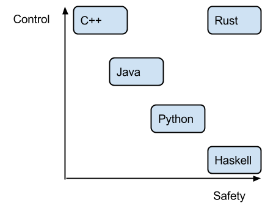
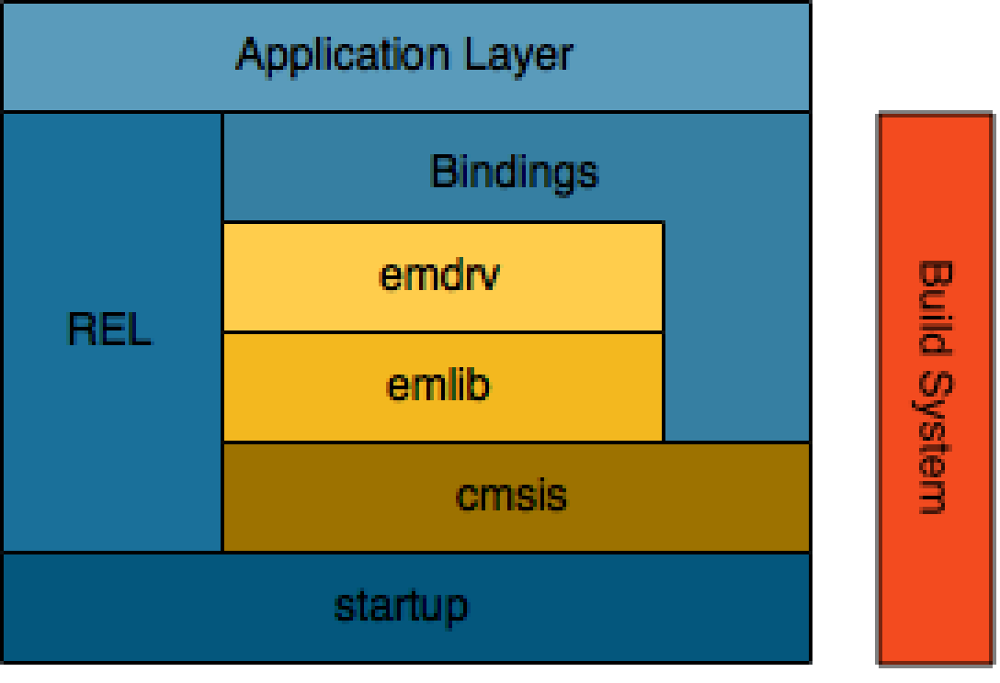
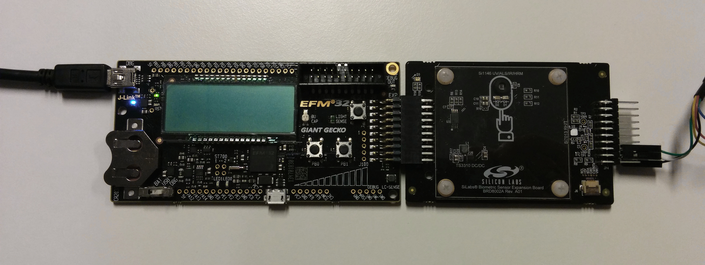
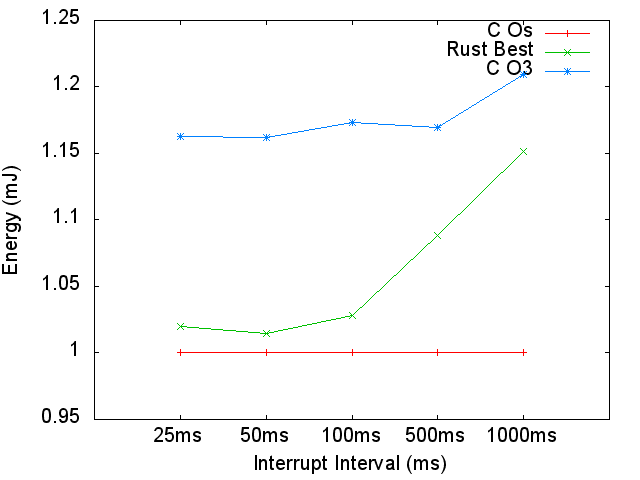
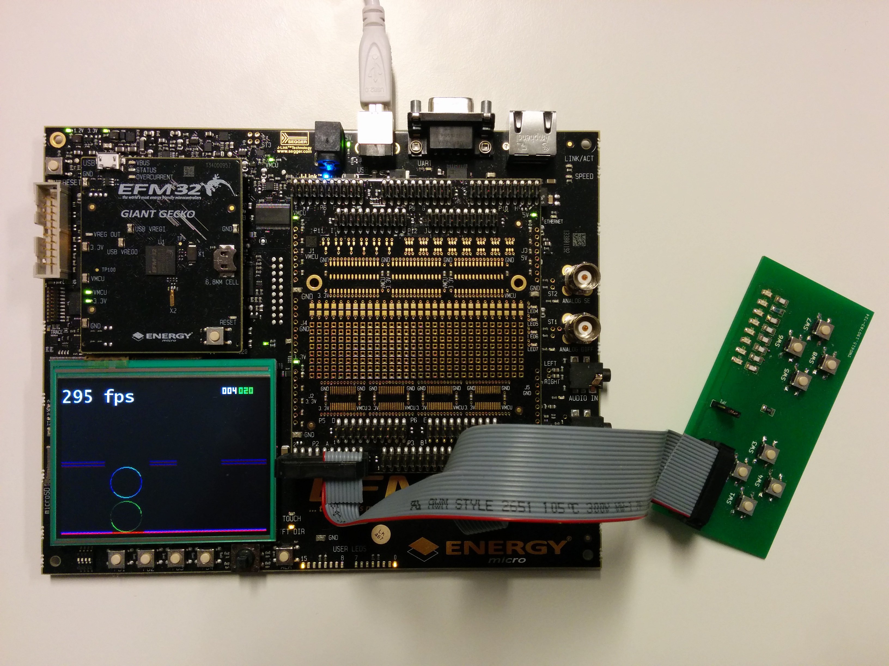
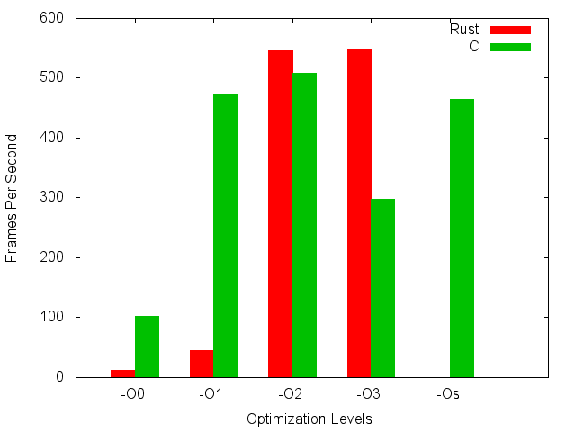
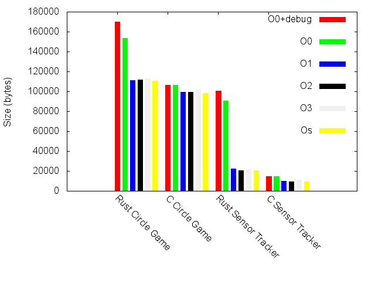

# RustyGecko - Developing Rust on Bare-Metal (Giant Gecko) #

Rust is an new programming language from Mozilla which reached 1.0 in May 2015.
The aim with this language is to replace C/C++ for developing web browsers like Firefox.
The language design has been driven by another research project at Mozilla, namely the [Servo browser](https://en.wikipedia.org/wiki/Servo_(layout_engine)).
This problem area requires both low-level control and an increasing focus on safety.
One of Rusts novel approaches are to statically [guarantee memory safety](https://air.mozilla.org/guaranteeing-memory-safety-in-rust/), which lets the language provide similar safety guarantees as garbage collected languages without incurring the runtime costs.

Rust also focuses on Zero-Cost Abstractions, in this lies, in addition to a lot of other things, the fact that Rust has minimal requirements for a runtime system.
This makes the language a candidate for use in a bare-metal embedded systems.
By bare-metal, we mean a system running without an operating system.

In this blog post we give a brief overview of the project using Rust on a Giant Gecko, as part of our master thesis at the Norwegian University of Science and Technology (NTNU).

## Project Members ##

Sondre Leffsaker, Håvard Høiby, Magnus Hetland Lie (supervisor), Antonio Garcia Guirado (supervisor) and Marius Grannæs (supervisor)

## Project Description ##

In this project we explore programming the Giant Gecko EFM32 microcontroller in Rust.
We reused the emlib peripheral API by adding partial Rust [bindings](http://blog.rust-lang.org/2015/04/24/Rust-Once-Run-Everywhere.html) and developed a build system for easing the development.
The resulting platform, called RustyGecko, was evaluated by implementing two applications and measuring; performance, code size and energy consumption.

## SensorTracker ##

The SensorTracker application uses the [Giant Gecko Starter Kit][stk], the [Biometric Expansion Evaluation Board][bio] and an [USB TTL FTDI Cable][ftdi].
The application senses, each _n_ millisecond, the internal temperature sensor on the Starter Kit and the Humidity and Temperature sensor on the Biometric board and stores this data in RAM.
The application exposes the data through a Command Line Interface over UART using the USB cable.

We used this application to measure the Energy Consumption of an application written in Rust and compared it to an equivalent application written in C using the libraries provided with Simplicity Studio.

As seen above the energy consumption of the Rust application is never more than 15% more than the best performing C application given at the Os optimization level.
In addition the O3 optimization level for the C application performs worse than both the Rust and C Os version.
This was found to be due to a poor cache hit ratio for the O3 version.

## CircleGame ##

The CircleGame application is a graphical game written for the [Giant Gecko Development Kit][dk].
The game was initially written as a solution to one of the assignment for the course [TDT4258](http://www.ntnu.edu/studies/courses/TDT4258) by Antonio Garcia Guirado.
We adapted the game and ported it to Rust.

To measure the performance of the game we recorded the Frames Per Seconds and compared the results over the standard range of optimization levels.

The results shows that on the best performing builds Rust and C expose comparable performance.
As a curiosity the performance decrease for the O3 build is caused by the _-ftree-loop-distribute-patterns_ optimization flag.

## Code Size ##

An important metric in embedded computing is the size of the end binary.
This binary must fit in the storage of the microcontroller and the size of this storage is directly related to the cost of the system as a whole.
We measured the size of the SensorTracker and Circle Game built at different optimization levels.

We see clearly from the results that the debug and optimized Rust builds are quite large compared to all other builds.
And in addition the size of C build is always smaller than the Rust build.
The smallest Rust SensorTracker build is 2.2x larger than the smallest C build of the same application.

## How to make a RustyGecko Project ##

### Prerequisite ###
- nightly version of the [Rust compiler](http://www.rust-lang.org/install.html).
- [arm-none-eabi-gcc](https://launchpad.net/gcc-arm-embedded/+download) or the one included with Simplicity Studio

### Seed project ###

We have set up a small seed project which includes the uses the emlib bindings to blink a led on the [Giant Gecko Starter Kit][stk] at [Seed](https://github.com/RustyGecko/seed).
On a system satisfying the prerequisites given above, the program is compile with the command `cargo build --target thumbv7m-none-eabi`.
To produce a binary file run the command `arm-none-eabi-objcopy -O binary target/thumbv7m-none-eabi/debug/seed seed.bin`.
This can be flashed to the Starter Kit.

## Summary of our discussion ##

Through this project we have found that the performance and energy consumption are quite similar for Rust and C application.
However, the code size of Rust binaries are larger than their C counterparts, especially when building for debugging.

The language in it self did not pose any restrictions on the programmability in a bare-metal system, due to the modularity of the standard library.
And we were able to adapt the build system for our platform.
Although all this modularity, we found that reusing existing libraries which depend on the standard library as a whole (in practice nearly all libraries), are impossible to reuse, or requires modification of the library to be used.

## Materials/Boards ##
- [Giant Gecko Starter Kit][stk]
- [Giant Gecko Development Kit][dk]
- [Biometric Expansion Evaluation Board][bio]
- Custom Game Pad
- [USB TTL FTDI Cable][ftdi]

## Resources ##

All of the code we developed in this project is available at <http://github.com/RustyGecko>.
The highlight of this code is the [SensorTracker](https://github.com/RustyGecko/sensor-tracker), [CircleGame](https://github.com/RustyGecko/circle-game) and [emlib](https://github.com/RustyGecko/emlib) repositories.

For more information on Rust we refer the reader to the language [home page](http://rust-lang.org) (especially the [Book](https://doc.rust-lang.org/stable/book/) and [Blog](http://blog.rust-lang.org/)) and the [subreddit](http://www.reddit.com/r/rust).

[stk]: https://www.silabs.com/products/mcu/lowpower/Pages/efm32gg-stk3700.aspx
[dk]: https://www.silabs.com/products/mcu/lowpower/Pages/efm32gg-dk3750.aspx
[bio]: http://www.silabs.com/products/sensors/Pages/biometric-exp-evb.aspx
[ftdi]: http://www.ftdichip.com/Products/Cables/USBTTLSerial.htm